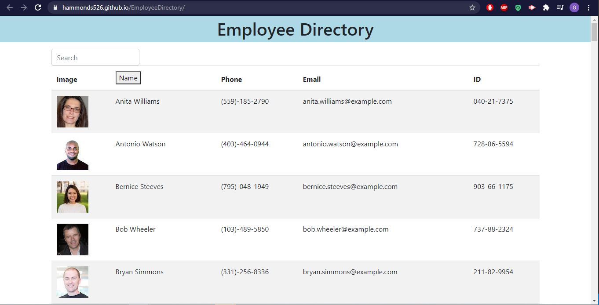

# Employee Directory
Search and Sort your employees in a easy to view table

**Technologies used: Javascript, Node.js, Axios, and React (class-based)

-------------------------------

This assignment presented a couple challenges. I struggled a bit with the format of the .map function but once that was figured out, the only issue was the sorting method. 

I met with my tutor to just discussed basic React concepts and the layout of the application. Other than the above challenges, the assignment was quite simple.

-----------------

Github Link : https://hammonds526.github.io/EmployeeDirectory/

## Screenshots 

